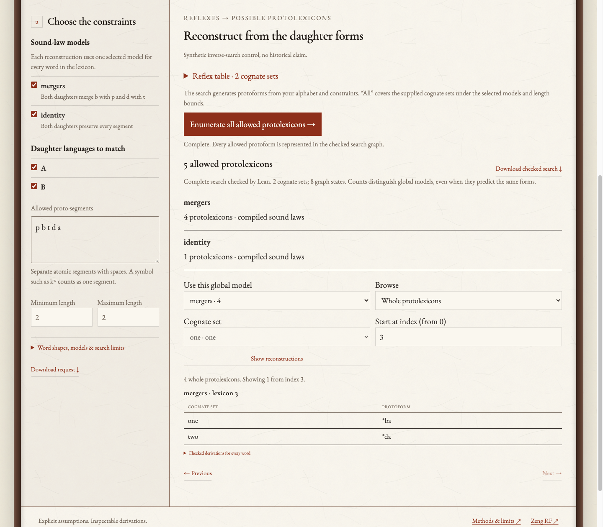
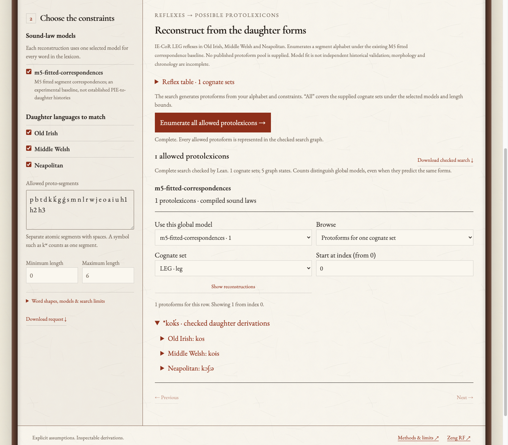
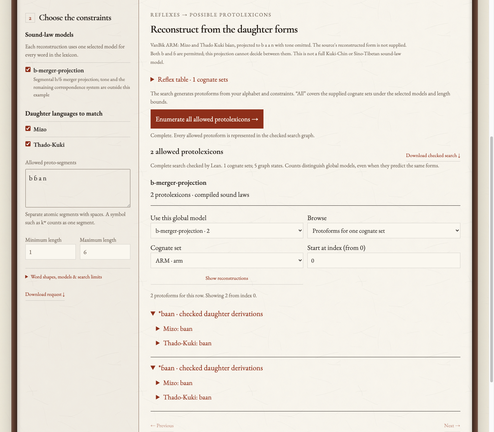

# M7 examples and performance assessment

These examples were rerun against the M7 engine at commit
`d3d6932b263a40e853acd99d393488bbd5ecaae9`. [examples.json](examples.json)
contains native results, checked derivations, three timing samples for each
small example, and input hashes. Screenshots are actual Chrome captures of the
interface with the reflex-table disclosure collapsed to make the results
visible. No result text or stylesheet was altered for the captures.

Reproduce with the built native executables and the repository's Python/browser
dependencies:

```bash
python scripts/capture_m7_examples.py --lean-version v4.19.0 --output /tmp/m7-examples
```

## Whole lexicons under alternative models

The two synthetic daughter languages both have `pa` for row one and `ta` for
row two. Both rows must use the same selected global sound-law model.

| Selected model | Complete assignments, in row order |
| --- | --- |
| `mergers`: both daughters merge b into p and d into t | `(pa, ta)`, `(pa, da)`, `(ba, ta)`, `(ba, da)` |
| `identity`: both daughters preserve every segment | `(pa, ta)` |

Thus the interface reports five **model-qualified** protolexicons, representing
four distinct word lists. The screenshot shows the fourth assignment under the
merger model. Restricting the allowed proto-alphabet to `p t a` while selecting
only the merger model leaves exactly `(pa, ta)`. The original search took a
median 0.129 seconds across three runs; the restricted search took 0.126 seconds.



## Indo-European LEG

| Daughter | Supplied segmented reflex |
| --- | --- |
| Old Irish | `k o s` |
| Middle Welsh | `k o ɨ s` |
| Neapolitan | `k ɔ ʃː ə` |

With the existing M5 fitted correspondence model, 23 allowed proto-segments
and maximum length six, the complete output is **`*koḱs`**. The search took a
median 0.144 seconds and produced a five-state graph. The finite space before
reflex constraints contains 154,764,793 strings; it is represented symbolically,
not visited string by string.

This is a conditional output of the fitted baseline. It is not independent
confirmation of a PIE etymology. The rules retain their training provenance,
and their treatment of morphology and chronology is incomplete.



## Kuki-Chin ARM

VanBik's Mizo and Thado Kuki forms are both `báan`. This example omits tone and
supplies `b a a n` for each daughter. Under a stipulated `ɓ → b` merger, with
both b and ɓ in the proto-alphabet, the complete output is **`*baan`, `*ɓaan`**.
The search took a median 0.126 seconds. Restricting this example to segmental
forms does not establish a historical Kuki-Chin onset analysis or reconstruct
the tone system.



## Measured performance

Small-case times include native request validation, graph generation, native
completeness checking and the independent count comparison. They exclude the
subsequent displayed-word derivation request. The large benchmark additionally
materializes one whole lexicon and checks its 3,000 branch certificates.

| Test | Complete outcome | Time |
| --- | --- | --- |
| Two-merger example, both models | 5 model-qualified protolexicons | 0.129 s median of 3 |
| PIE LEG, fitted model | 1 word | 0.144 s median of 3 |
| Kuki-Chin ARM, stipulated merger | 2 words | 0.126 s median of 3 |
| Incompatible global models | 0 whole protolexicons | 0.127 s median of 3 |
| Deletion with missing/unknown observations | 50 protolexicons | 0.127 s median of 3 |
| 1,000 distinct synthetic cognate rows | `64^1000 = 2^6000` assignments represented in 2,341 graph nodes | 3.549 s, one fresh run |

The fresh [large benchmark](benchmark.json) used a conservative memory upper
bound of 436.2 MiB on the documented Intel i5-3470 iMac13,2 with 16 GiB RAM.
The earlier [delivery benchmark](../m7-benchmark-local.json) took 2.571 seconds
on the same host and engine. These are measurements of a favorable synthetic
unconditional-rule problem. They do not establish runtime for a complete
historical grammar or imply that exponentially many outputs were printed.

Contextual sound change currently uses the exhaustive reference fallback.
Keeping the same single-row intervocalic-voicing example and three-symbol
alphabet while increasing the maximum word length gave:

| Maximum length | Strings before reflex constraints | Outcome | Measured time |
| --- | ---: | --- | ---: |
| 3 | 40 | Complete, one word | 0.134 s |
| 6 | 1,093 | Complete, one word | 0.240 s |
| 8 | 9,841 | Complete, one word | 1.299 s |
| 12 | 797,161 | Incomplete: five-second search budget exhausted | 5.137 s |

These are single runs with an explicitly selected **five-second** generation
budget, rather than the default 60 seconds. Length 12 was not shown to have no
solutions. The extra elapsed time includes request validation and exception
handling outside that generation budget.

## Assessment

The ratings below are engineering judgments about readiness, not measured
accuracy percentages or an independent external review. Overall: **8/10 as a
verified bounded enumeration tool; 3/10 toward comprehensive reconstruction of
real whole protolanguages.**

| Dimension | Rating | Evidence and remaining limitation |
| --- | --- | --- |
| Correctness within the declared model | 9/10 | Kernel-checked soundness/completeness and 1,488 inverse-set comparisons. Parsing, counts, pagination and browser behavior are tested infrastructure; the entire application is not formally proved. |
| Speed for the compiled fragment | 8/10 | Compact representations and a few seconds for the 1,000-row synthetic control. Large realistic family grammars have not been benchmarked. |
| Scaling with contextual laws | 4/10 | Exact fallback is available, but its prefix search grows exponentially and hit the selected short time budget in a single-row stress case. |
| Interface usability | 6/10 | Actual Kiwari styling, selectable constraints and inspectable derivations work. Sound-law editing still requires JSON, tables require manual segmentation, and model-qualified counts need explanation. No independent usability study has been conducted. |
| Historical reconstruction readiness | 3/10 | Selected laws and cognacy are supplied; linguistic models and coverage remain incomplete, with specialist review pending. No M7 held-out historical-accuracy benchmark has been established. |

The existing model evaluations make the historical limitation concrete. In the
earlier [M5 report](../pie-evaluation.json), the fitted PIE correspondence
baseline exactly produced **1/79 supported held-out reflexes (1.27%)**; another
54 of the 133 test reflexes were unsupported. In the earlier
[M6 report](../sino-tibetan-evaluation.json), the Kuki-Chin correspondence
baseline exactly produced **15/53 supported held-out reflexes (28.30%)**;
another 24 of the 77 test reflexes were unsupported. Including unsupported
records in the denominator gives 0.75% and 19.48% coverage respectively.
These are forward predictions by earlier fitted models, not accuracy estimates
for M7's new generative inverse search. The successful examples above are not
representative held-out accuracy tests.

The most useful next work is a verified efficient compiler for contextual
sound laws, historically reviewed rule chronologies and representations, and
a frozen held-out evaluation of M7 on complete cognate sets. A visual rule
editor and a spreadsheet-style reflex editor would make the existing engine
easier to use.
